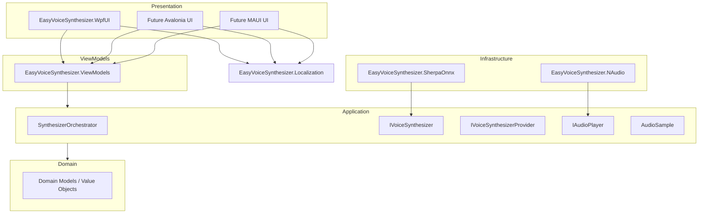

# EasyVoiceSynthesizer

EasyVoiceSynthesizer is a text-to-speech application focused on **language learning and pronunciation practice**.

The goal is simple: type a word or a sentence, generate its pronunciation, and listen to it immediately.

The project is currently in development and is designed to evolve from a simple word pronunciation tool into a more complete language-learning application based on synthetic voices and interactive dialogues.

## Current status

🚧 **Work in progress**

The current version focuses on generating and playing the pronunciation of text entered by the user.

At the moment, **German** is the only available language.

Planned languages include:

* 🇬🇧 English — British
* 🇺🇸 English — American
* 🇫🇷 French
* 🇪🇸 Spanish
* 🇮🇹 Italian
* 🇯🇵 Japanese

Additional languages may be added later.

## Main features

### Word and sentence pronunciation

Enter a word or a sentence and generate its pronunciation.

The generated audio can be played directly without creating temporary audio files.

The current architecture keeps speech synthesis and audio playback independent, allowing different implementations to be used depending on the target platform.

### Conversation mode

A second mode is planned for entering texts as a **conversation**, with multiple characters.

Each character will have its own voice, making it possible to distinguish speakers naturally.

For example:

```text
Alice: Guten Morgen! Wie geht es dir?
Bob: Guten Morgen! Mir geht es gut.
Alice: Was machst du heute?
```

Different characters may use different voices.

A conversation may also contain multiple languages, allowing mixed-language scenarios.

This mode is intended to support learning methods based on dialogues, such as the approach used by **Assimil**.

### Interactive playback

The conversation will be fully interactive.

Depending on where the user clicks:

* clicking a **word** plays that word;
* clicking a **speech bubble** plays the complete sentence;
* clicking at the beginning of a sequence plays the complete sequence.

This should make it possible to easily repeat difficult words, sentences, or entire dialogues.

## Conversation editor

A dedicated editor is planned for creating learning material.

The user will be able to:

1. Create a conversation.
2. Add characters.
3. Select a voice for each character.
4. Select the language used by each character.
5. Enter the dialogue.
6. Generate and play the corresponding audio.
7. Save the conversation for later use.

A character could therefore speak French in one conversation while another speaks English, German, Japanese, etc.

The language belongs to the character/dialogue content rather than being a global application setting.

## Translation

Translations will also be supported for learning purposes.

The planned interface is a two-column layout:

```text
┌──────────────────────────────┬──────────────────────────────┐
│ Original                     │ Translation                  │
├──────────────────────────────┼──────────────────────────────┤
│ Guten Morgen!                │ Good morning!                │
│ Wie geht es dir?             │ How are you?                 │
│ Mir geht es gut.             │ I'm doing well.              │
└──────────────────────────────┴──────────────────────────────┘
```

The translation area may be collapsible, for example using an `Expander`, so that the learner can hide the translation while practicing.

This allows two learning modes:

* **translation visible** — useful while learning;
* **translation hidden** — useful for testing comprehension.

## Training player

A dedicated player is planned for practicing conversations.

The player should allow the learner to:

* play the entire dialogue;
* play one sentence;
* repeat a sentence;
* repeat a word;
* navigate through the conversation;
* show or hide translations;
* practice listening and pronunciation.

The goal is to make the application useful not only for generating audio, but also for **actively practicing a language**.

---
# Architecture

EasyVoiceSynthesizer follows a Clean Architecture-inspired structure.




```text
EasyVoiceSynthesizer
│
├── Domain
│   └── EasyVoiceSynthesizer.Domain
│
├── Application
│   └── EasyVoiceSynthesizer.Application
│
├── ViewModels
│   └── EasyVoiceSynthesizer.ViewModels
│
├── Localization
│   └── EasyVoiceSynthesizer.Localization
│
├── Infrastructure
│   ├── EasyVoiceSynthesizer.SherpaOnnx
│   ├── EasyVoiceSynthesizer.NAudio
│   ├── EasyVoiceSynthesizer.MicrosoftSpeech   (planned)
│   ├── EasyVoiceSynthesizer.AvaloniaAudio     (planned)
│   └── EasyVoiceSynthesizer.MauiAudio         (planned)
│
└── Presentation
    ├── EasyVoiceSynthesizer.WpfUI
    ├── EasyVoiceSynthesizer.AvaloniaUI      (planned)
    └── EasyVoiceSynthesizer.MauiUI          (planned)
```

The application layer defines abstractions such as:

```text
IVoiceSynthesizer
IAudioPlayer
IVoiceSynthesizerProvider
```

Infrastructure projects provide the concrete implementations.

This makes it possible to use different speech synthesis and audio technologies without coupling the application logic to a specific library.

For example:

```text
Application
     │
     ├── IVoiceSynthesizer
     │       │
     │       ├── Sherpa-ONNX
     │       └── Microsoft Speech
     │
     └── IAudioPlayer
             │
             ├── NAudio
             ├── Avalonia audio backend
             └── MAUI audio backend
```

The dependency injection configuration is defined by the application that actually uses the components. This keeps each target platform in control of which implementations it includes.

---

# Technologies

## Platform

* **.NET 10**
* C#

## Current UI

* **WPF**

An **Avalonia** version is planned for cross-platform desktop support.

A **.NET MAUI** version may also be developed, particularly for Android.

## Speech synthesis

### Sherpa-ONNX

The current speech synthesis implementation uses **Sherpa-ONNX**.

Sherpa-ONNX provides the TTS engine and models used to generate audio samples.

The application layer only receives its own platform-independent representation:

```csharp
public record AudioSample(
    int SampleRate,
    float[] Samples);
```

This prevents the rest of the application from depending directly on Sherpa-ONNX or any audio library.

### Other synthesis engines

Other synthesis engines may be added later, for example:

* Microsoft Speech
* other local TTS engines
* online/cloud TTS providers

Each implementation can live in its own infrastructure project.

## Audio playback

### NAudio

The current WPF implementation uses **NAudio** for audio playback.

Audio generated by the speech synthesis engine is kept in memory and converted to the format required by NAudio by the NAudio-specific implementation.

No temporary audio files are required for normal playback.

Other platforms may use different audio implementations.

Possible future implementations include:

* Avalonia-compatible audio libraries
* `Plugin.Maui.Audio` for the MAUI version
* platform-specific audio backends when appropriate

---

# Planned project structure

The project is intentionally designed so that additional synthesis engines and UI platforms can be added independently.

For example:

```text
Infrastructure
│
├── EasyVoiceSynthesizer.SherpaOnnx
│   └── SynthesizerSherpaOnnx
│
├── EasyVoiceSynthesizer.MicrosoftSpeech
│   └── SynthesizerMicrosoftSpeech
│
├── EasyVoiceSynthesizer.NAudio
│   └── NAudioPlayer
│
└── EasyVoiceSynthesizer.MauiAudio
    └── MauiAudioPlayer
```

The exact structure may evolve as the project grows.

---

# Learning material format

Conversation and learning material will eventually be stored in a portable format.

The current idea is to use either:

* JSON
* XML

The final format has not been decided yet.

A conversation will likely contain information such as:

```text
Conversation
 ├── Characters
 │    ├── Name
 │    ├── Language
 │    └── Voice
 │
 └── Dialogue
      ├── Speaker
      ├── Text
      └── Translation
```

This should allow learning material to be created, edited, saved, and reused independently from the application itself.

---

# Roadmap

## Current

* [x] WPF application
* [x] .NET 10
* [x] Sherpa-ONNX integration
* [x] German TTS
* [x] In-memory audio generation
* [x] NAudio playback
* [x] Application/infrastructure separation

## Next

* [ ] Multiple voices
* [ ] English — British
* [ ] English — American
* [ ] French
* [ ] Spanish
* [ ] Italian
* [ ] Japanese
* [ ] Voice synthesizer selection
* [ ] Conversation editor
* [ ] Multiple characters
* [ ] Per-character voice selection
* [ ] Per-character language selection
* [ ] Interactive word/sentence/dialogue playback
* [ ] Translation display
* [ ] Training player
* [ ] Conversation persistence
* [ ] JSON/XML learning material format

## Future platforms

* [ ] Avalonia
* [ ] Android / .NET MAUI
* [ ] Other platforms depending on available speech synthesis and audio backends

---

# Philosophy

EasyVoiceSynthesizer is intended to remain **modular and platform-independent at its core**.

Speech synthesis, audio playback, user interface, and learning material are deliberately kept separate.

The goal is to be able to change the underlying technology without rewriting the application itself.

For example, replacing NAudio with another audio backend should not require changes to the speech synthesis logic or the conversation system.

Likewise, adding a new TTS engine should not require changes to the UI or the core application logic.

The project is therefore built around small abstractions and independent implementations rather than a single monolithic infrastructure layer.
